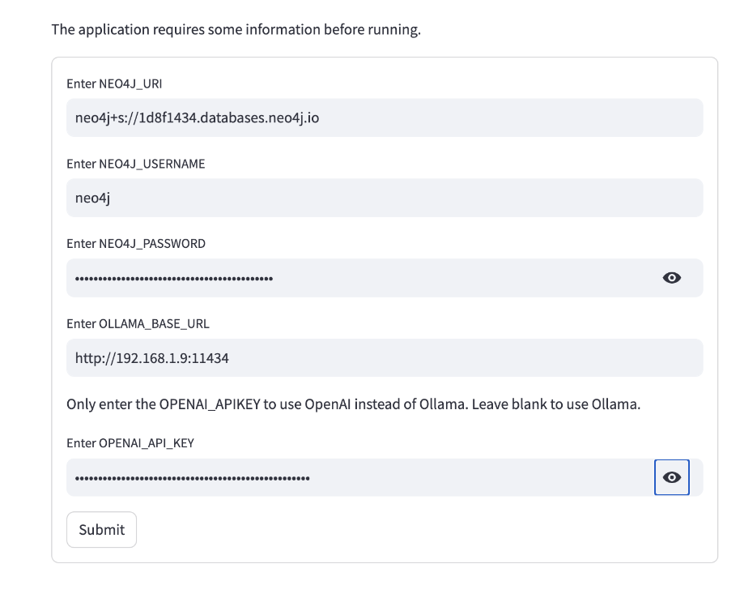

# docker-genai-sample

A simple GenAI app for [Docker's Docs](https://docs.docker.com/) based on the [GenAI Stack](https://github.com/docker/genai-stack) PDF Reader application.

In this guide, you’ll learn how to:

- Containerize and run a Python-based GenAI application
- Set up a local environment to run the complete GenAI stack locally for development
- Start by containerizing an existing GenAI application.


## What's this sample app all about?

The sample application used in this guide is a modified version of the PDF Reader application from the [GenAI Stack](https://github.com/docker/genai-stack) demo applications. The application is a full stack Python application that lets you ask questions about a PDF file.

The application uses [LangChain](https://www.langchain.com/) for orchestration, [Streamlit](https://streamlit.io/) for the UI, [Ollama](https://ollama.ai/) to run the LLM, and [Neo4j](https://neo4j.com/) to store vectors.

Clone the sample application. Open a terminal, change directory to a directory that you want to work in, and run the following command to clone the repository:

```console
$ git clone https://github.com/ajeetraina/docker-genai-sample
```

You should now have the following files in your `docker-genai-sample` directory.

```text
├── docker-genai-sample/
│ ├── .gitignore
│ ├── app.py
│ ├── chains.py
│ ├── env.example
│ ├── requirements.txt
│ ├── util.py
│ ├── LICENSE
│ └── README.md
```

## Initialize Docker assets

Now that you have an application, you can use `docker init` to create the necessary Docker assets to containerize your application. Inside the `docker-genai-sample` directory, run the `docker init` command. `docker init` provides some default configuration, but you'll need to answer a few questions about your application. For example, this application uses Streamlit to run. Refer to the following `docker init` example and use the same answers for your prompts.

```console
$ docker init
Welcome to the Docker Init CLI!

This utility will walk you through creating the following files with sensible defaults for your project:
  - .dockerignore
  - Dockerfile
  - compose.yaml
  - README.Docker.md

Let's get started!

? What application platform does your project use? Python
? What version of Python do you want to use? 3.11.4
? What port do you want your app to listen on? 8000
? What is the command to run your app? streamlit run app.py --server.address=0.0.0.0 --server.port=8000
```

You should now have the following contents in your `docker-genai-sample`
directory.

```text
├── docker-genai-sample/
│ ├── .dockerignore
│ ├── .gitignore
│ ├── app.py
│ ├── chains.py
│ ├── compose.yaml
│ ├── env.example
│ ├── requirements.txt
│ ├── util.py
│ ├── Dockerfile
│ ├── LICENSE
│ ├── README.Docker.md
│ └── README.md
```

To learn more about the files that `docker init` added, see the following:
 - [Dockerfile](../../../engine/reference/builder.md)
 - [.dockerignore](../../../engine/reference/builder.md#dockerignore-file)
 - [compose.yaml](../../../compose/compose-file/_index.md)


## Run the application

Inside the `docker-genai-sample` directory, run the following command in a
terminal.

```console
$ docker compose up --build
```

Docker builds and runs your application. Depending on your network connection, it may take several minutes to download all the dependencies. You'll see a message like the following in the terminal when the application is running.

```console
server-1  |   You can now view your Streamlit app in your browser.
server-1  |
server-1  |   URL: http://0.0.0.0:8000
server-1  |
```

Open a browser and view the application at [http://localhost:8000](http://localhost:8000). You should see a simple Streamlit application. The application may take a few minutes to download the embedding model. While the download is in progress, **Running** appears in the top-right corner.




The application requires a Neo4j database service and an LLM service to
function. If you have access to services that you ran outside of Docker, specify
the connection information and try it out. If you don't have the services
running, continue with this guide to learn how you can run some or all of these
services with Docker.

In the terminal, press `ctrl`+`c` to stop the application.

## Summary

In this section, you learned how you can containerize and run your GenAI
application using Docker.
