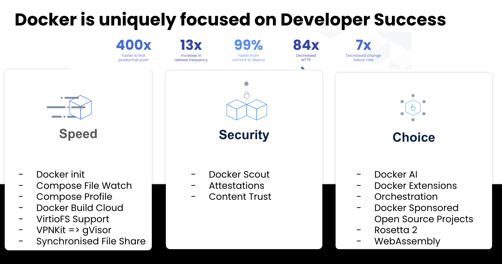

Developing apps today requires so much more than writing code. Multiple languages, frameworks, architectures, and discontinuous interfaces between tools for each lifecycle stage creates enormous complexity. Docker simplifies and accelerates your workflow, while giving developers the freedom to innovate with their choice of tools, application stacks, and deployment environments for each project.

In 2013, Docker introduced what would become the industry standard for containers. Containers are a standardized unit of software that allows developers to isolate their app from its environment, solving the “it works on my machine” headache. For millions of developers today, Docker is the de facto standard to build and share containerized apps – from desktop, to the cloud. We are building on our unique connected experience from code to cloud for developers and developer teams.

Docker has been around for over 10-years. We started in the container space focused on making it easier for organizations to modernize with container technology. Over the years we have evolved our initial offering to meet the needs of modern developers, focusing on enabling developers to build container based applications locally. 

## Overview of Docker Desktop

Docker Desktop is the easiest way for developers using containers in production to edit, run, test, and share containerized apps locally on Linux, Windows, and macOS machines. Docker Desktop works out-of-the-box — meaning it comes with the entire environment needed to develop and run Linux, Windows, and macOS containers locally (on the developer’s laptop). Docker Desktop also handles many of the tedious and complex tasks associated with setting up containers. This allows developers to continue focusing on what they love and do best — writing code — instead of spending hours setting up and maintaining Docker locally (i.e., updating the VM, networking, and file sharing mapping between the host and the VM and all the tooling needed to run Docker locally). 

## Docker is focused on Developer Success

Docker Desktop is a powerful tool designed to simplify and streamline the development and deployment of applications using Docker containers. Let's break down the key points mentioned in the description:

## Speed

Docker Desktop helps developers maximize their productivity by reducing the time spent on setup and configuration. With Docker, developers can easily package their applications and all their dependencies into containers, allowing for a consistent and reproducible development environment. This eliminates the need for complex manual setups and ensures that everyone on the team can have the same development environment, minimizing the setup overhead.

## Security

Docker Desktop is designed to provide non-intrusive and actionable security features. It allows developers to identify and address security vulnerabilities during the development process, known as the "inner loop," rather than waiting for later stages like continuous integration (CI) or production. Docker also provides features like container isolation, which enhances security by ensuring that applications run in isolated environments with restricted access to the host system.

## Choice

Docker Desktop empowers developers with the freedom to explore and experiment with various technologies. Docker's containerization approach allows developers to use different tools and technologies for different parts of their applications without conflicts or compatibility issues. Developers are not limited to monolithic and "one-size-fits-all" development environments; instead, they can choose the best tools for their specific use cases.
Overall, Docker Desktop's features cater to developers' needs for a fast and efficient development process, enhanced security practices, and the flexibility to use diverse technologies based on the requirements of their projects. This combination of speed, security, and choice makes Docker Desktop a popular choice among developers looking to containerize and manage their applications effectively.

