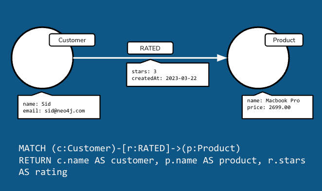

Cypher is a declarative graph query language that allows for efficient querying and updating of graph databases, such as those managed by Neo4j. It's designed to be intuitive and to closely resemble English, making it easier to express complex queries and manipulations of graph data. It uses an ASCII-art style syntax consisting of brackets, dashes and arrows.



You can use Cypher to perform a variety of operations on a graph database, including:

- **Creating nodes and relationships**: You can define new nodes and the relationships between them.
- **Querying data**: Cypher allows you to retrieve nodes, relationships, and properties based on specific criteria.
- **Updating data**: You can use Cypher to modify existing nodes and relationships, including adding or updating properties.
- **Deleting data**: Nodes, relationships, and properties can be removed from the graph.

Cypher queries typically involve specifying patterns that describe the shape of the data you're interested in. These patterns can include nodes, relationships, and the directions of those relationships.


## Cypher Syntax

Let's dive deeper into Cypher, providing some syntax examples and explanations for common operations you can perform on a graph database using this language.

### Creating Nodes and Relationships

To create a node, you use the `CREATE` statement. Nodes can have labels (which can be thought of as types or categories) and properties (key-value pairs).

```
CREATE (n:Person {name: 'Alice', age: 30})
```

This creates a node with the label `Person` and two properties: `name` with the value 'Alice' and `age` with the value 30.

To create a relationship between two nodes, you also use the `CREATE` statement. Relationships have types and can also have properties.

```
CREATE (n:Person {name: 'Alice'})-[:FRIEND_OF {since: 2021}]->(m:Person {name: 'Bob'})
```

This creates two `Person` nodes and a `FRIEND_OF` relationship from Alice to Bob, with a property since indicating the year they became friends.

### Querying Data

To retrieve data, you use the `MATCH` statement, which allows you to specify patterns to find in the graph. You can also use `WHERE` to filter results, and `RETURN` to specify what to return.

```
MATCH (n:Person {name: 'Alice'})
RETURN n
```

This query looks for a `Person` node with the name 'Alice' and returns it.

You can also query relationships:

```
MATCH (n:Person)-[r:FRIEND_OF]->(m:Person)
WHERE n.name = 'Alice'
RETURN n, r, m
```

This finds `Person` nodes that are friends of Alice and returns the nodes and the relationships.

### Updating Data

To update data, you can use `SET` to add or change properties of nodes and relationships.

```
MATCH (n:Person {name: 'Alice'})
SET n.age = 31
RETURN n
```

This updates Alice's age to 31.

### Deleting Data

To delete nodes and relationships, you use the `DELETE` statement.

```
MATCH (n:Person {name: 'Alice'})
DELETE n
```

This deletes the `Person` node with the name 'Alice'. Note that you must delete or detach all relationships of a node before you can delete the node itself.

### Aggregation and Ordering

Cypher supports aggregation functions similar to SQL, as well as ordering results.

```
MATCH (n:Person)
RETURN n.age, COUNT(n) AS num_people
ORDER BY n.age
```

This query returns the ages of all `Person` nodes and the count of people for each age, ordered by age.

### Combining Operations

You can combine these operations to perform complex queries and updates. For example, you might want to find all friends of Alice, increment their ages, and return the updated nodes:

```
MATCH (n:Person {name: 'Alice'})-[:FRIEND_OF]->(friend:Person)
SET friend.age = friend.age + 1
RETURN friend
```

This finds all of Alice's friends, increments their ages by 1, and returns the updated friend nodes.


Cypher's syntax and operations are designed to be intuitive for dealing with graph structures, making it easier to express complex queries involving nodes, relationships, and properties.