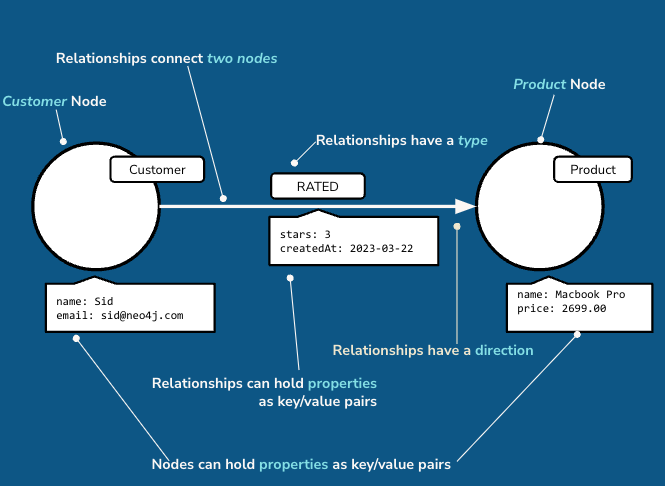

## Introduction to Neo4j

[Neo4j](https://neo4j.com/) is a highly popular graph database management system, designed for storing and querying interconnected data. Unlike traditional relational databases that store data in tables, Neo4j is based on graph theory, using nodes, relationships, and properties to represent and store data. The key components of Neo4j include:

- Nodes: Entities or objects such as people, businesses, accounts, or any item you want to track.
- Relationships: Connections between nodes, which can be directed and named and may carry properties. These relationships provide context and add richness to the data model.
- Properties: Key-value pairs that store data associated with nodes and relationships, allowing for the storage of detailed information about the entities in the graph.

Neo4j is particularly well-suited for applications that require complex queries and analysis of connected data, such as social networks, recommendation engines, fraud detection, and more. Its Cypher query language is specially designed for querying graph data in an expressive and efficient manner.

You can get started with Neo4j with [AuraDB](www.neo4j.com/aura) and for more learning content check out Free, Self-Paced, Hands-on Online Training Courses at [Neo4j GraphAcademy](https://graphacademy.neo4j.com/).

## Introduction to Knowledge Graphs

Knowledge Graphs are a form of graph-based data representation that organize and integrate information in a way that makes it possible for computers to understand and interpret. They consist of nodes representing entities (such as people, places, concepts, and objects) and edges representing the relationships between these entities. Knowledge graphs are used to store interconnected descriptions of entities with free-form semantics, allowing for a dynamic and interconnected representation of knowledge.

The power of knowledge graphs lies in their flexibility and the richness of the semantics they can capture, making them an essential tool for many applications, including:

- Semantic Search: Enhancing search capabilities by understanding the context and relationships between terms.
- Recommendation Systems: Offering personalized recommendations based on the interconnected nature of user interests and behavior.
- Natural Language Processing (NLP): Improving the understanding of human language by mapping out relationships and entities in text.
- Data Integration: Unifying data from multiple sources and formats, providing a holistic view of information.

Knowledge graphs can be implemented using various storage technologies, including graph databases like Neo4j, which provides a robust platform for managing complex, connected data structures.

## Relationship between Neo4j and Knowledge Graphs

Neo4j can be used as the underlying database technology for building knowledge graphs. Its graph-based model aligns naturally with the structure of knowledge graphs, enabling efficient storage, querying, and management of interconnected data. By leveraging Neo4j, developers can create powerful applications that harness the full potential of knowledge graphs, from complex data analysis to AI-driven insights.

In summary, Neo4j and Knowledge Graphs represent a powerful paradigm for managing and analyzing interconnected data. They offer a flexible and semantically rich way to model relationships and insights that are difficult to capture with traditional database systems, opening up new possibilities for understanding and leveraging data in various domains.