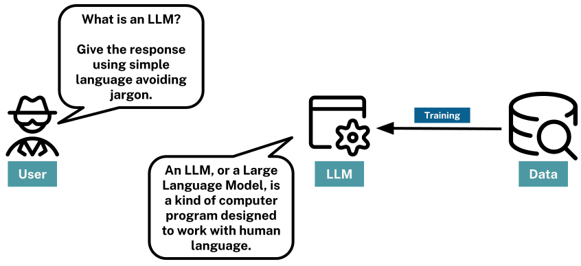

Large Language Models, referred to as LLMs, learn the underlying structure and distribution of the data and can then generate new samples that resemble the original data.

LLMs are trained on vast amounts of text data to understand and generate human-like text. LLMs can answer questions, create content, and assist with various linguistic tasks by leveraging patterns learned from the data.

Generative AI is a class of algorithms and models that can generate new content, such as images, text, or even music. New content is generated based on user prompting, existing patterns, and examples from existing data.

## Instructing an LLM
The response generated by an LLM is a probabilistic continuation of the instructions it receives. The LLM provides the most likely response based on the patterns it has learned from its training data.

In simple terms, if presented with the prompt "*Continue this sequence - A B C*", an LLM could respond "*D E F*".

To get an LLM to perform a task, you provide a **prompt**, a piece of text that should specify your requirements and provide clear instructions on how to respond.




Precision in the task description, potentially combined with examples or context, ensures that the model understands the intent and produces relevant and accurate outputs.

An example prompt may be a simple question.

```
What is the capital of Japan?
```

Or, it could be more descriptive. For example:

```
Tell me about the capital of Japan.
Produce a brief list of talking points exploring its culture and history.
The content should be targeted at tourists.
Your readers may have English as a second language, so use simple terms and avoid colloquialisms.
Avoid Jargon at all costs.
Return the results as a list of JSON strings containing content formatted in Markdown.
```

The LLM will interpret these instructions and return a response based on the patterns it has learned from its training data.