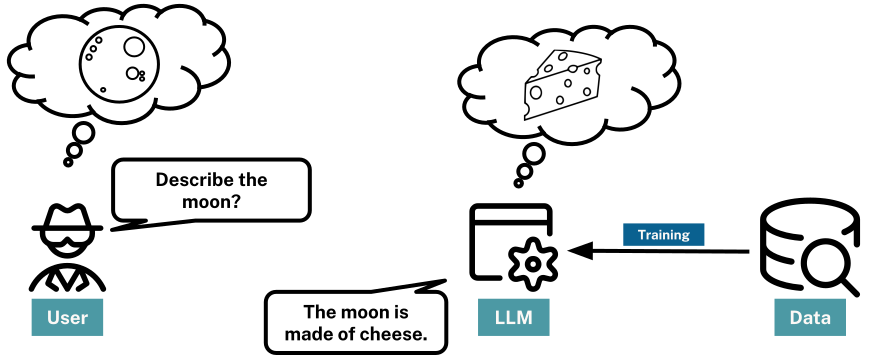

While LLMs provide a lot of potential, you should also be cautious.

At their core, LLMs are trained to predict the following word(s) in a sequence.

The words are based on the patterns and relationships from other text in the training data. The sources for this training data are often the internet, books, and other publicly available text. This data could be of questionable quality and maybe be incorrect. Training happens at a point in time, it may not reflect the current state of the world and would not include any private information.

LLMs are fine-tuned to be as helpful as possible, even if that means occasionally generating misleading or baseless content, a phenomenon known as hallucination.

For example, when asked to "*Describe the moon.*" and LLM may respond with "*The moon is made of cheese.*". While this is a common saying, it is not true.

While LLMs can represent the essence of words and phrases, they don’t possess a genuine understanding or ethical judgment of the content.

These factors can lead to outputs that might be biased, devoid of context, or lack logical coherence.

## Fixing Hallucinations
Providing additional **contextual** data helps to ground the LLM’s responses and make them more accurate.

A knowledge graph is a mechanism for providing additional data to an LLM. Data within the knowledge graph can guide the LLM to provide more relevant, accurate, and reliable responses.

While the LLM uses its language skills to interpret and respond to the contextual data, it will not disregard the original training data.

You can think of the original training data as the base knowledge and linguistic capabilities, while the contextual information guides in specific situations.

The combination of both approaches enables the LLM to generate more meaningful responses.
