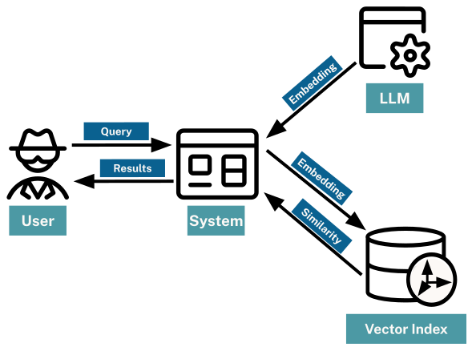

Grounding is the process of providing context to an LLM to improve the accuracy of its responses. For developers and data scientists, grounding usually offers the highest impact for the lowest effort.

## Data Cut-Off Dates
Training a Large Language Model has a high computational cost. According to Wikipedia, OpenAI’s GPT-3 model was trained on 175 billion parameters, and the resulting trained model takes 800GB to store.

Retraining a model on new data would be expensive and time-consuming. A model may take weeks or months to train.

Providing real-time updates on fast-moving breaking news would be out of the question.

## Retrieval Augmented Generation
A news agency could train a model on static data and supplement the pre-existing knowledge base with real-time data retrieved from up-to-date sources.

This approach is known as **Retrieval Augmented Generation**, or **RAG**

RAG combines the strengths of large-scale language models with external retrieval or search mechanisms, enabling relevant information from vast datasets to be dynamically fed into the model during the generation process, thereby enhancing its ability to provide detailed and contextually accurate responses.

In summary, by adding content from additional data sources, you can improve the responses generated by an LLM.

### Benefits of RAG
The main benefit of RAG is its **enhanced accuracy**. By dynamically pulling information from external, domain-specific sources, a response grounded by RAG can provide more detailed and contextually accurate answers than a standalone LLM.

RAG provides additional benefits of:

- Increased transparency, as the sources of the information can be stored and examined.

- Security, as the data sources can be secured and access controlled.

- Accuracy and timeliness, as the data sources can be updated in real-time.

- Access to private or proprietary data

RAG could support the new agency chatbot by:

1. Accessing real-time new feeds

2. Pulling recent headlines or news articles from a database,

3. Giving this additional context to the LLM

New articles stored in a knowledge graph would be ideal for this use case. A knowledge graph could pass the LLM detail about the relationship between the entities involved and the article’s metadata.

For example, when asking about the results of a recent election, the knowledge could provide additional context about the candidates, news stories relating to them, or interesting articles from the same author.

One of the challenges of RAG is understanding what the user is asking for and surfacing the correct information to pass to the LLM.

## Semantic Search vs. Traditional Keyword Search
Semantic search aims to understand search phrases' intent and contextual meaning, rather than focusing on individual keywords.

Traditional keyword search often depends on exact-match keywords or proximity-based algorithms that find similar words.

For example, if you input "apple" in a traditional search, you might predominantly get results about the fruit.

However, in a semantic search, the engine tries to gauge the context: Are you searching about the fruit, the tech company, or something else?

The results are tailored based on the term and the perceived intent.

## Vectors and embeddings
In natural language processing (NLP) and machine learning, numerical representations (known as **vectors**) represent words and phrases.

Each dimension in a vector can represent a particular semantic aspect of the word or phrase. When multiple dimensions are combined, they can convey the overall meaning of the word or phrase.

A vector will not directly encode tangible attributes like color, taste, or shape. Instead, the model will generate a list of numerical values that closely align the word with related words such as health, nutrition, and wellness.

When applied in a search context, the vector for "apple" can be compared to the vectors for other words or phrases to determine the most relevant results.

You can create vectors in various ways, but one of the most common methods is to use a **large language model**. These vectors are known as **embeddings**. With advanced models, these embeddings also contain contextual information.

For example, the embeddings for the word "apple" are `0.0077788467, -0.02306925, -0.007360777, -0.027743412, -0.0045747845, 0.01289164, -0.021863015, -0.008587573, 0.01892967, -0.029854324, -0.0027962727, 0.020108491, -0.004530236, 0.009129008, ` and so on.

The vector for a word can change based on its surrounding context. For instance, the word `bank` will have a different vector in `river` bank than in `savings` bank.

Semantic search systems can use these contextual embeddings to understand user intent.

You can use the `distance` or `angle` between vectors to gauge the semantic similarity between words or phrases.

Words with similar meanings or contexts will have vectors that are close together, while unrelated words will be farther apart.

This principle is employed in semantic search to find contextually relevant results for a user’s query.

A semantic search involves the following steps:

1. The user submits a query.

2. The system creates a vector representation (embedding) of the query.

3. The system compares the query vector to the vectors of the indexed data.

4. The results are scored based on their similarity.

5. The system returns the most relevant results to the user.

Vectors can represent more than just words. They can also represent entire documents, images, audio, or other data types. They are instrumental in the operation of many other machine-learning tasks.

## Vectors and Neo4j
Vectors are the backbone of semantic search. They enable systems to understand and represent the complex, multi-dimensional nature of language, context, and meaning.

Since the v5.11 release, Neo4j has a Vector search index, allowing you to query for nodes based on their vector representations.